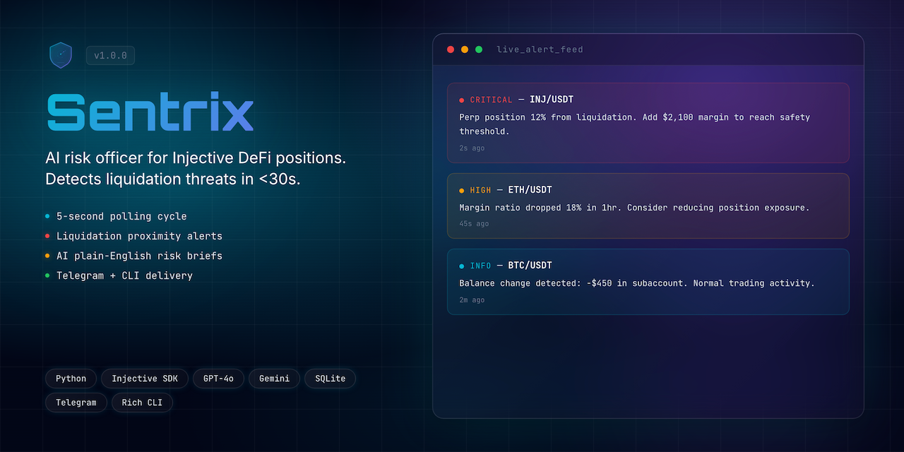
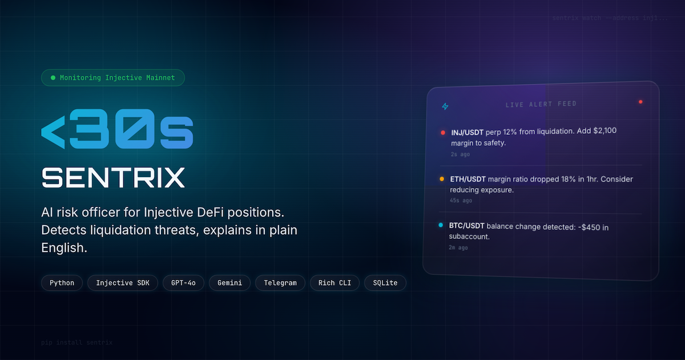
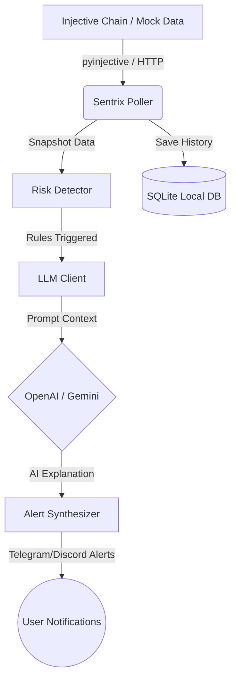

<div align="center">
  <h1>Sentrix 🛡️</h1>
  <p><em>AI-powered DeFi position monitor and risk analyst for Injective</em></p>
  

  <br/>

  [](https://youtu.be/NpVsBugTKyE)
  [](https://www.hackquest.io/hackathons/Injective-Solo-AI-Builder-Sprint)

  <br/>

  
  
  
  
  
  
  
  [](https://github.com/edycutjong/sentrix/actions/workflows/ci.yml)

</div>

---

## 📸 See it in Action

<div align="center">
  
</div>

> **Stay ahead of liquidations.** Monitor → Detect → Analyze → Deliver.

---

## 💡 The Problem & Solution
DeFi traders often lose funds to liquidations because monitoring multiple derivative positions 24/7 is virtually impossible. Liquidation risks change dynamically based on market volatility, entry prices, and funding rates.

**Sentrix** is a lightweight, edge-native terminal client and daemon that continuously monitors your Injective derivative and spot portfolios. When a risk metric (such as a drop in margin ratio or proximity to liquidation price) is violated, Sentrix leverages advanced LLMs to explain the danger in plain English and deliver an actionable alert to Telegram or Discord before it is too late.

**Key Features:**
- ⚡ **Real-Time On-chain Monitoring:** Polls Injective derivative positions and spot balances every 30s.
- 🔒 **Deterministic Risk Detection:** Instantly detects liquidation proximity, sudden balance drops, and margin ratio degradation.
- 🤖 **AI Risk Analysis:** Natural-language risk analysis and action plans generated via OpenAI GPT-4o-mini or Google Gemini Flash.
- 🔔 **Multi-Channel Alert Delivery:** Integrated Discord and Telegram notification alerts.
- 📊 **Terminal Interface:** Built-in Click & Rich CLI to view status, history, and real-time logs.

---

## 🤖 How AI is Used in Sentrix
Sentrix is an AI-native utility designed to bridge the gap between raw blockchain data and human action.

1. **Natural-Language Risk Synthesis:** Rather than sending cryptic numeric alerts (e.g., `margin_ratio = 1.15`), Sentrix feeds the entire position context (leverage, size, entry price, current mark price, distance to liquidation, and available spot collateral) to the LLM (`src/sentrix/clients/llm.py`).
2. **Actionable Recommendations:** The LLM translates the complex status into plain English, determining the exact USD margin injection needed to restore the position to a safe 1.5x margin level (e.g., *"Urgent: Deposit $2,100 to avoid liquidation"*).
3. **Flexible LLM Backend Providers:** Out-of-the-box integration with both **OpenAI (GPT-4o-mini)** and **Google Gemini (Gemini 1.5 Flash)**.
4. **Resilient Fallback Mode:** If API limits or connectivity issues prevent contact with the LLM, Sentrix gracefully falls back to deterministic template-based risk reports to guarantee safety.

---

## ⛓️ Injective Integration Details
Sentrix connects directly to the Injective ecosystem using the official SDK (`injective-py`), leveraging 5 core integration interfaces:

1. **`IndexerGrpcDerivativeApi`** (via `AsyncClient.fetch_derivative_positions`): Periodically polls open perpetual derivative positions for target accounts, retrieving entry prices, margins, leverage, and liquidation prices.
2. **`ChainGrpcBankApi`** (via `AsyncClient.fetch_bank_balances`): Queries native token balances (e.g., `inj`, `usdt`) held in the user's main wallet.
3. **`IndexerGrpcAccountApi`**: Tracks subaccount portfolios to accurately measure margin isolation and asset cross-collateralization.
4. **`IndexerGrpcSpotApi`**: Evaluates spot market balances to check if free assets are available to shore up deteriorating margin positions.
5. **`IndexerGrpcOracleApi`**: Moniters oracle price feeds to verify mark prices and calculate margin degradation under high volatility.

* **Judge-Optimized Demo Mode:** Includes a deterministic chain-mocking mode (`--demo` flag) that generates simulated derivative positions and spot balances (using real Injective ticker formats like `INJ/USDT` and `BTC/USDT`) to allow judges to evaluate the app immediately without requiring a funded private key or wallet connections.

### ⚔️ Why Injective? (Sponsor Defense)
Sentrix is built specifically for Injective's on-chain architecture:
- **On-chain Orderbook & Derivatives Engine:** On other networks, tracking open positions and liquidation thresholds requires querying multiple indexing APIs or running custom margin calculation databases. Injective provides derivative position state natively at the ledger level, enabling sub-second local risk evaluation.
- **Unified Subaccount Architecture:** Sentrix is optimized for Injective's subaccounts, allowing traders to monitor isolated risk profiles independently.

### 🔒 Security & Honest Limitations
- **Strictly Read-Only:** Sentrix is a passive monitoring daemon. It **does not** take custody of your private keys or sign transactions. It is physically incapable of executing trades, transferring funds, or liquidating positions. Even in the event of a full server compromise, your funds remain secure.
- **Actionable, Non-Custodial Alerts:** Sentrix analyzes and alerts you of the exact dollar amount needed to save a position, leaving the actual transaction to be executed securely by the user via Keplr, Leap, or standard dashboards.

---

## 🏗️ Architecture & Tech Stack



| Layer | Technology |
|---|---|
| **Runtime** | Python 3.12 |
| **Chain SDK** | `injective-py` (v1.7+) |
| **AI Integrations** | OpenAI `gpt-4o-mini` / Google `gemini-1.5-flash` |
| **Alerts / Webhooks** | `python-telegram-bot` (v21.0+) / Discord Webhooks |
| **CLI / Interface** | Click (v8.0+) + Rich (v13.0+) |
| **Database** | SQLite via `aiosqlite` (v0.20+) |

---

## 🚀 Getting Started

### Prerequisites
- Python ≥ 3.11
- Telegram Bot Token / Discord Webhook URL (optional)
- OpenAI API Key or Gemini API Key (optional, defaults to template alerts)

### Installation
1. Clone the repository:
   ```bash
   git clone https://github.com/edycutjong/sentrix.git
   cd sentrix
   ```
2. Set up virtual environment and install dependencies:
   ```bash
   python -m venv .venv
   source .venv/bin/activate
   pip install -e ".[dev]"
   ```
3. Set up your environment variables:
   ```bash
   cp .env.example .env
   # Open .env and add your address, LLM keys, or bot tokens
   ```
4. Configure your alert parameters:
   ```bash
   cp config.example.yaml config.yaml
   # Customize thresholds for liquidations and notification channels
   ```

### Command Reference

#### 1. Watch & Daemon Mode
Start the monitoring daemon. Use `--demo` to simulate live risk changes and test alert configurations.
```bash
# Run in Demo mode (Recommended for judges!)
sentrix watch --demo

# Run live on-chain watching a specific address
sentrix watch --address inj1youraddresshere

# Run with specific configuration file
sentrix watch --config config.yaml
```

#### 2. Get Immediate Status
Retrieve a beautiful terminal summary of current positions and spot balances.
```bash
# Show status of mock positions
sentrix status --demo

# Show status of an active Injective address
sentrix status --address inj1youraddresshere
```

#### 3. View Alert History
Browse historical alarms stored in the local SQLite engine:
```bash
sentrix history
```

---

## ☁️ Deployment
Sentrix is designed to run as a lightweight background daemon (worker process) and can be easily deployed to **Railway** to monitor Injective portfolios 24/7.

For detailed setup instructions, environment configurations, and Railway deployment steps, see the [Sentrix Deployment Guide](file:///Users/edycu/Projects/Hackathon/Sentrix/docs/DEPLOYMENT.md).

---

## 🧪 Testing & CI
The codebase maintains **100% test coverage**. You can run the entire linting and testing suite locally:

```bash
# Run Ruff linting
ruff check .

# Run all test suites with coverage report
pytest --cov
```

Continuous Integration is set up via GitHub Actions (`.github/workflows/ci.yml`) to validate code quality and correctness on every push.

### ⚡ Performance & Latency Benchmarks
Sentrix is optimized for edge-native, sub-millisecond execution to ensure alerts are generated immediately when risk rules are violated. You can run the performance simulation benchmark locally:

```bash
python3 scripts/bench.py
```

**Typical Benchmark Results (100 runs):**
- **Risk Detection Latency:** `p50 = 0.01ms` | `p95 = 0.01ms` (Evaluation of margin and balance rules)
- **Full Cycle Processing Latency:** `p50 = 0.08ms` | `p95 = 0.11ms` (From raw chain snapshot ingestion to structured alert packaging, excluding async external API calls)

---

## 📁 Project Structure
```
sentrix/
├── .github/
│   ├── dependabot.yml         # Dependency update schedule
│   └── workflows/
│       ├── ci.yml             # Github Actions CI Pipeline
│       └── codeql.yml         # Automated Security Scanning
├── docs/                      # Documentation and asset store
│   └── DEPLOYMENT.md          # Railway deployment guide
├── src/
│   └── sentrix/
│       ├── cli.py             # Click Command line interface
│       ├── config.py          # Configuration loading/parsing
│       ├── core/
│       │   ├── detector.py    # Risk assessment logic
│       │   └── poller.py      # Main async polling loop
│       ├── clients/
│       │   ├── injective.py   # Injective blockchain wrapper
│       │   ├── llm.py         # OpenAI/Gemini client
│       │   ├── telegram.py    # Telegram bot sender
│       │   └── discord.py     # Discord webhook sender
│       ├── models/            # Pydantic schemas (alert, position, etc.)
│       └── storage/
│           └── db.py          # SQLite persistence store
├── tests/                     # 14 test suite files
├── .env.example               # Template environment variables
├── pyproject.toml             # Package definitions and tooling
├── railway.json               # Railway build/deploy configuration
└── README.md                  # You are here
```

---

## 📄 License
[MIT](LICENSE) © 2026 Edy Cu

## 🙏 Acknowledgments
Built for the **Injective Solo AI Builder Sprint** (HackQuest 2026). Special thanks to Injective Labs and Google for the AI tools and libraries.
